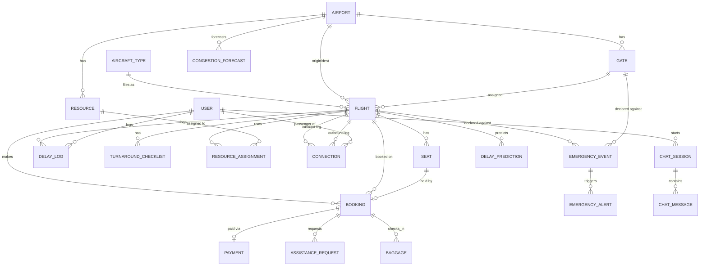
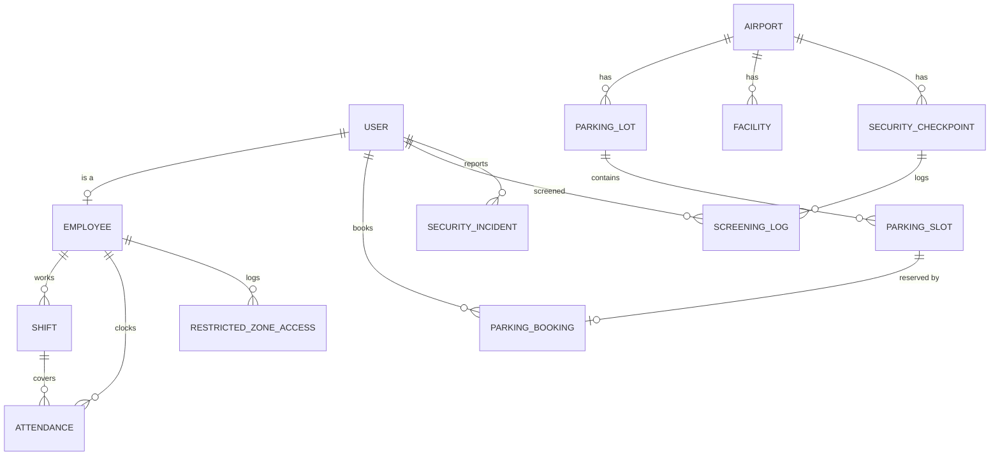

# Entity-Relationship Diagram

This renders automatically on GitHub (Mermaid support). If viewing elsewhere,
paste the block into https://mermaid.live.

Split into two diagrams for readability: **Core + Booking/Ops** and
**Tier-2 modules**. Both hang off the same core tables (`Flight`, `User`,
`Booking`, `Employee`), which is the point — one shared operational layer,
not twelve silos.

## Diagram 1 — Core, Ops, Booking, Delay, Connections, Emergency, Chatbot

## Diagram 2 — Staff, Parking, Facilities, Security (Tier 2)

## Notes for the report

- `User` is the auth/identity table (JWT, roles). `Employee` and `Passenger`
  are role-specific profile extensions of `User` — this avoids duplicating
  auth logic per role, which is worth a sentence in the architecture section
  of the report.
- `Flight` is the busiest table in the schema by relationship count — it's
  touched by Ops Core, Booking, Delay, Connections, Emergency, and
  Predictive Analytics. That fan-out is exactly the "one shared core, many
  views" claim from the architecture doc, and it's visible directly in the
  diagram, which makes it an easy thing to point to when a grader asks how
  the modules integrate.
